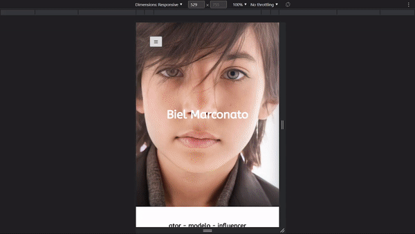

<h1 align="center">Biel Marconato Portfolio</h1>

<ul type="none" align="center">
    <li>
        
        
        
        
        
        
</ul>

    <blockquote>Portfolio de Biel Marconato</blockquote>
    Ampliar e aplicar meus conhecimentos de desenvolvimento front-end utilizando NextJS

    

        <h2>Preview</h2>
        <table align="center">
            <tr>
                <td></td>
                <td></td>
            </tr>
            <tr>
                <td>Página inicial - PC</td>
                <td>Página inicial - Celular</td>
            </tr>
        </table>
    

 

    <h2>Responsividade</h2>
    

        
    

    

        <kbd>
            <h2>Victor T.</h2>
            

                
                
                 
            

            <a href="https://github.com/vitu1928">
                
                 
            </a>
            

                 
                
                
        </kbd>
        

        

